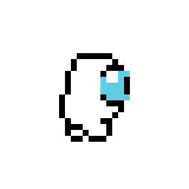
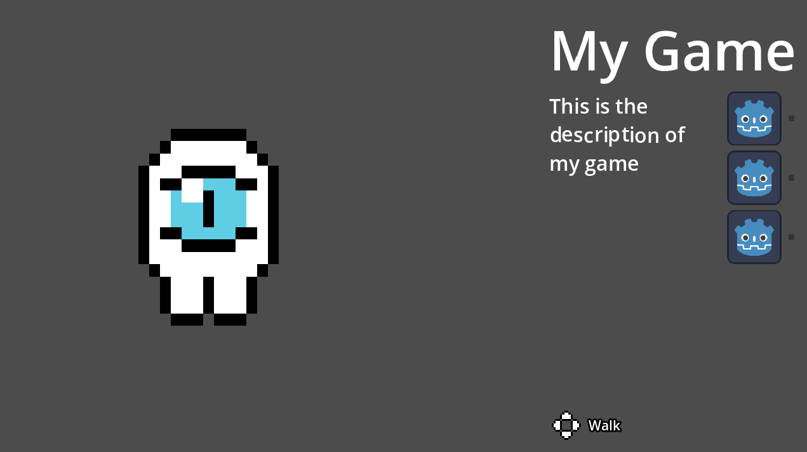
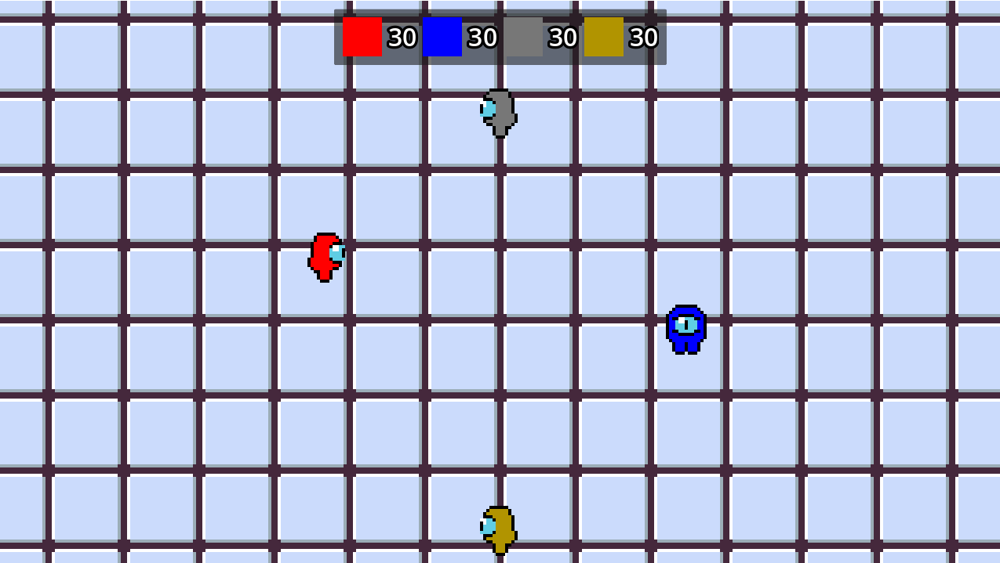
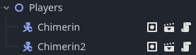
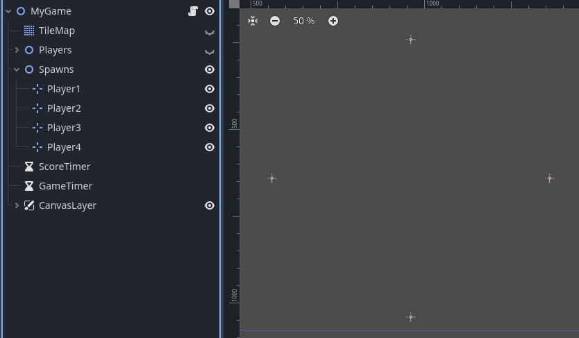
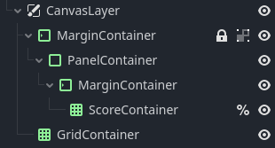
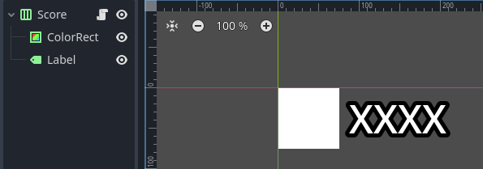
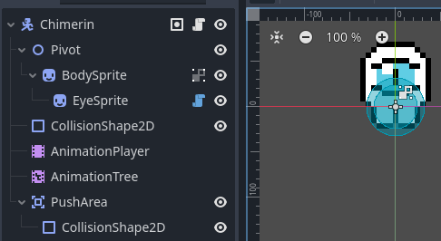
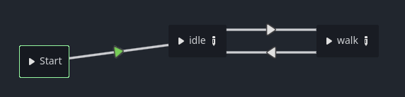
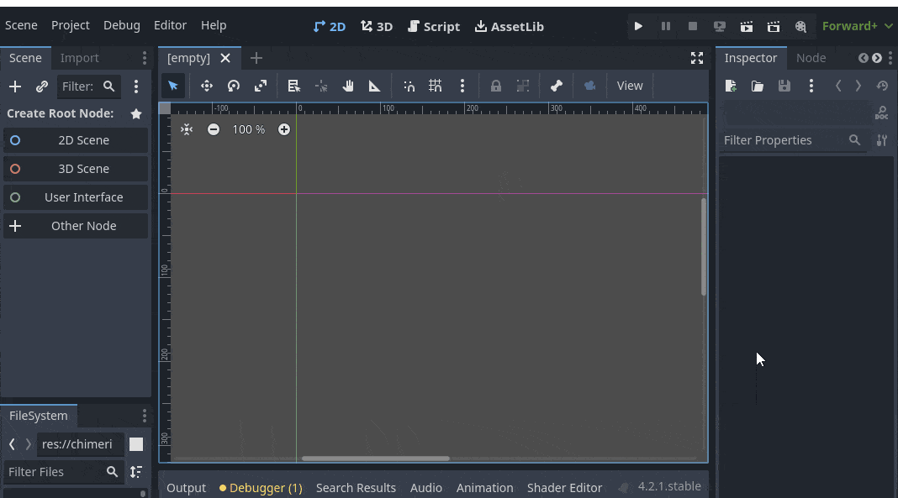

# Chimera Party Lab

 Laboratorio (plantilla) de minijuegos para [*Chimera Party*](https://github.com/elixs/chimera-party), un Party Game colaborativo de la comunidad de desarrollo de videojuegos de la Universidad de Chile.

<br clear="left"/>

<p align="center">
  <a href="#instalación">Instalación</a> •
  <a href="#diseño">Diseño</a> •
  <a href="#setup">Setup</a> •
  <a href="#desarrollo">Desarrollo</a> •
  <a href="#desarrollo">Ejemplo</a> •
  <a href="#importación">Exportación</a> •
  <a href="#importación">Importación</a> •
  <a href="#creditos">Créditos</a>
</p>

---

## Instalación

0. Instala [Godot 4.2.x](https://godotengine.org/download).
1. Clona este repositorio.
2. Abre godot e importa el proyecto.

## Diseño

Al desarrollar tu minijuego, tienes libertad total en cuanto a la temática y las mecánicas de juego, la creatividad se valora mucho aquí! Sin embargo, debes adherirte a las siguientes restricciones para asegurar la jugabilidad y el equilibrio:

- 🔢 **Número de jugadores:** El juego debe estar diseñado para ser jugado por entre 2 y 8 participantes. Puedes enfocarte en un número (o rango) específico de jugadores, siempre y cuando se mantenga dentro de este límite.
- 🎨 **Representación de jugadores:** Es crucial que las representaciones en el juego de los jugadores sean claras y correspondan fielmente al color que cada uno elija al inicio del juego.
- 💯 **Puntaje:** Tu minijuego debe incluir un elemento competitivo, asignando puntajes a los jugadores por su desempeño. Importante: el puntaje máximo que un jugador puede obtener **no debe exceder los 100 puntos**, ni ser menor a los -100 puntos.
- ⌚ **Tiempo:** Se sugiere no superar un tiempo de ronda de 1 minuto. La idea es que el juego progrese rápido para alcanzar a jugar una gran variedad de minijuegos.

## Setup

Una vez [instalado](#instalación), cambia el nombre de la carpeta `res://games/my_game` al nombre de tu juego. La carpeta `my_game` ya viene con un boilerplate de juego que puedes usar de referencia. Este código se explica en la [sección de ejemplo](#ejemplo).

> [!WARNING]
> Todo el contenido de tu juego debe estar dentro de la carpeta creada a base de "my_game". Esto incluye código, escenas, sprites, etc.

### Datos del minijuego

En el recurso `info.tres` se define el nombre, la descripción y la portada de tu juego:


También se definen los inputs que usa tu juego. Estos se muestran como iconos al partir la ronda. Estos consisten en un arreglo de grupos de botones con una descripción. Por ejemplo, Left, Right, Up y Down descritos como Walk.


> [!TIP]
> Puedes ver un preview de tu pantalla de información corriendo la escena game_info.tscn en la carpeta ui_lab.

### Configuración del ambiente de testing

En el nodo `Game` de `game.tscn` en `autoload_lab` se definen parametros de testeo, que no seran aplicados en la versión exportada del minijuego.

#### Test Players

El numero de jugadores que deseas tener al **testear** tu juego, con sus colores correspondientes.


#### Test Game Path

La ruta del `main.tscn` de tu minijeugo, luego de que le hayas cambiado el nombre a la carpeta.

#### Test Game Info

El recurso `info.tres` mencionado en [Datos del minijuego](#datos-del-minijuego).

### Prueba el juego

Ponle play al proyecto. Deberías ver la pantalla de inicio con la información que ingresaste.



Luego apreta `espacio` o `enter` para comenzar la ronda de prueba.



## Desarrollo

A continuación, se explica como usar las interfaces y carácteristicas de *Chimera Party* para crear tu minijuego. El ejemplo que viene con el proyecto se explica en [la siguiente sección](#ejemplo).

### Jugadores

Se puede conseguir la lista de jugadores con:

```gdscript
Game.players: List[PlayerData]
```

Un objeto `PlayerData` consiste en:

| Nombre            | Tipo    | Descripción                                                        |
| ----------------- | ------- | ------------------------------------------------------------------ |
| `input`           | `int`   | ID del layout y dispositivo de este jugador. Ver [input](#input)   |
| `primary_color`   | `Color` | Color principal del jugador. Ver [colores](#colores)               |
| `secondary_color` | `Color` | Color secundario del jugador. *Experimental*                       |
| `score`           | `int`   | Puntaje total del jugador en la partida. Ver [puntaje](#puntaje)   |
| `local_score`     | `int`   | Puntaje del jugador en **este** minijuego. Ver [puntaje](#puntaje) |

### Input

#### Dispositivos/layouts

| ID  | Dispositio | Direccional | Acción        |
| --- | ---------- | ----------- | ------------- |
| 0   | Teclado    | W, A, S, D  | Z, X          |
| 1   | Teclado    | T, F, G, H  | V, B          |
| 2   | Teclado    | I, J, K, L  | N, M          |
| 3   | Teclado    | ↑, ←, ↓, →  | RShift, RCtrl |
| 4   | Gamepad 0  | ↑, ←, ↓, →  | A, B          |
| 5   | Gamepad 1  | ↑, ←, ↓, →  | A, B          |
| 6   | Gamepad 2  | ↑, ←, ↓, →  | A, B          |
| 7   | Gamepad 3  | ↑, ←, ↓, →  | A, B          |

#### Usando input

Donde `x` es el ID del input del jugador, las acciones de input en el proyecto tienen los siguientes nombres `move_up_x`, `move_left_x`, `move_down_x`, `move_right_x`, `action_a_x`, `action_b_x`.

Estas se pueden llamar como cualquier input de godot ya sea con eventos:

```gdscript
func _input(event):
    if event.is_action_pressed("move_up_" % player_data.input):
        jump()
```

O con polling:

```gdscript
func _physics_process(delta):
    if Input.is_action_pressed("move_right_" % player_data.input):
        position.x += speed * delta
```

Si usas de base la clase [CharacterPlayer](https://github.com/vgdev-uchile/chimera-party-lab/blob/master/scripts/character_player.gd), esto se simplifica. Se puede llamar directamente a `move_up`, `move_left`, `move_down`, `move_right`, `action_a` y `action_b`. Por ejemplo:

```gdscript
func _physics_process(delta: float) -> void:
    var move_input = Input.get_vector(
        move_left,
        move_right,
        move_up,
        move_down
    )
```

### Colores

El color del jugador se puede conseguir con

```gdscript
player_data.color
```

Si usas de base la clase [CharacterPlayer](https://github.com/vgdev-uchile/chimera-party-lab/blob/master/scripts/character_player.gd), puedes hacerle override a la función `update_color` para definir que hacer con el color del jugador. Por ejemplo:

```gdscript
func update_color() -> void:
    body_sprite.self_modulate = data.primary_color
```

> [!IMPORTANT]
> Pendiente: incluir explicación de los shaders

### Puntaje

Los puntajes se manejan en el objeto `PlayerData` de cada jugador. Si en tu juego se consigue puntaje continuamente, se puede actualizar el puntaje correspondiente de cada jugador con el valor de:

```gdscript
player_data.local_score: int
```

Si por algún motivo se necesita el puntaje total que lleva cada jugador, se puede acceder a:

```gdscript
player_data.score
```

### Game Over

Cuando se haya concluido la ronda de tu minijuego, debes llamar:

```gdscript
Game.end_game()
```

Si en el minijuego el puntaje solo se otorga al final, debe actualizarse antes de llamar a `Game.end_game()`.

### Utilidades

Se puede mostrar un mensaje en pantalla con:

```python
Debug.log("message")
```

### CharacterPlayer

En el proyecto existe esta clase que se puede usar como base para un personaje controlado por un jugador. Extiende CharacterBody2D, y abstrae algunas de las funcionalidades del multiplayer para hacer más sencillo todo. En particular:

1. Crea accesos directos a los inputs del jugador. (Ver [input](#input))
2. Define el objeto `PlayerData` del jugador como `data`
3. Provee una función `update_color` que se llama al correr el setup, para hacerle override.

El código de esta clase se puede encontrar en `scripts/character_player.gd`.

## Ejemplo

El juego de ejemplo que viene incluido en el proyecto, consiste en un juego 2D con personajes instanciados que extienden la clase [CharacterPlayer](#characterplayer). Cada jugador acumula puntaje simplemente por existir, y el juego se termina luego de 15 segundos.

### MyGame

El nodo principal de `main.tscn` (recordar que `main.tscn` es la escena del minijuego que se instancia al inciar una ronda).

En el evento `_ready` se encarga de:

1. Instanciar los prsonajes, corde al número de jugadores
2. Instanciar los contadores de puntaje

En la señal `_on_score_timeout` se encarga de sumarle puntaje a cada jugador.

### Players

Este nodo existe para ser padre de todos los personajes que se instancien. Tiene dos nodos marcados como `placeholder` (se eliminan al ejecutar el juego).



### Spawns

En este nodo se muestra un ejemplo de como se podría definir donde aparecen los personajes, usando nodos `Marker2D`, que luego en [MyGame](#mygame) se usan de referencia.



### CanvasLayer

El canvas layer tiene nodos para contener los puntajes, que se instancian como hijos de `ScoreContainer`.



### Score

Esta escena es instanciado como hijo de `ScoreContainer` por [MyGame](#mygame). En su código:

1. Es asignado un jugador en el `setup` lamado por `MyGame`
2. Actualiza el texto del label con el puntaje local actual del jugador



### Chimerin

La escena `chimerin_lab/chimerin.tscn` extiende la clase [CharacterPlayer](#characterplayer), y es instanciado por [MyGame](#mygame) como hijo de [Players](#players)



> [!TIP]
> Los nodos `BodySprite` y `EyeSprite` son separados para poder aplicar el color solo al cuerpo.

A continuación se explica lo que agreg por sobre la base

#### Input/Movimiento

En el evento `_physics_process`, se consigue el input usando los valores directos definidos por el `CharacterPlayer`:

```gdscript
var move_input = Input.get_vector(
    move_left,
    move_right,
    move_up,
    move_down)
```

Y se aplican de forma típica para Godot:

```gdscript
var target_velocity = speed * move_input
velocity = velocity.move_toward(target_velocity, acceleration * delta)
move_and_slide()
```

#### Animación

Según la dirección y magnitud de movimiento, se usa el nodo de `AnimationTree` para animar el chimerín:

```gdscript
if direction.length() > 0.01:
    animation_tree.set("parameters/idle/blend_position", direction)
    animation_tree.set("parameters/walk/blend_position", direction)

if velocity.length() > 50 or (playback.get_current_node() == "walk" and target_velocity.length() > 50):
    playback.travel("walk")
else:
    playback.travel("idle")
```



#### Color

En el setup, se modula directamente el color del `BodySprite` según el color del  `PlayerData` correspondiente:

```gdscript
func update_color() -> void:
    body_sprite.self_modulate = data.primary_color
```

#### Empuje

Los chimerines se pueden empujar entre si. Esto se maneja antes del movimiento en el `_physics_process`:

```gdscript
var direction = move_input
push_direction = move_input

for pusher in _pushers:
    var is_pushing = pusher.to_local(global_position).dot(pusher.push_direction) > 0
    if is_pushing:
        move_input += pusher.push_direction.project(global_position - pusher.global_position)
```

Este comportamiento es gatillado con las siguientes señales:

```gdscript
func _on_body_entered(body: Node) -> void:
    if body != self and body.is_in_group("chimerin"):
        body.start_pushing(self)

func _on_body_exited(body: Node) -> void:
    if body != self and body.is_in_group("chimerin"):
        body.stop_pushing(self)

# ^ Invocan los siguientes métodos: 

func start_pushing(pusher: CharacterBody2D) -> void:
    _pushers.append(pusher)

func stop_pushing(pusher: CharacterBody2D) -> void:
    _pushers.erase(pusher)
```

## Exportación

Una vez tengas listo tu juego, debes exportarlo para que se pueda instalar en el *Chimera Party*.

1. Ir al menu `Project` > `Export` del proyecto en Godot.
2. Elegir la plataforma. Por defecto *Chimera Party* está pensado para Windows.
3. Seleccionar la opción `PCK/Zip`.
4. Nombrar el archivo resultante con el **mismo nombre que la carpeta de tu juego**.
5. Guardar como `Godot Project Pack .PCK`.



## Importación

Para agregar un minijuego a la rotación del Chimera Party:

1. Descargar el último [ejecutable de *Chimera Party*](https://github.com/vgdev-uchile/chimera-party/releases).
2. Crear una carpeta `games` como hermano del ejecutable.
3. Dejar el `.pck` del minijuego en la carpeta `games`.

### Ejemplo de Importación

```bash
.
├── games/
│   ├── chimerin_quest.pck
│   └── beyond_them.pck
└── Chimera_Party.exe
```

> [!NOTE]
> En una partida normal cuando sale un minijuego una vez, su probabilidad de salir nuevamente en la misma partida se reduce a un 10%.

## Creditos

- Proyecto de la Comunidad VGDEV UCHILE.
- Creado por: [Elías Zelada](https://github.com/elixs)
- Contribuciones:
  - [Eric K](https://github.com/Nyveon)
