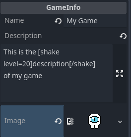
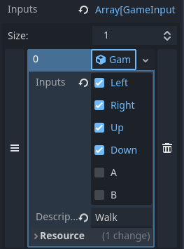
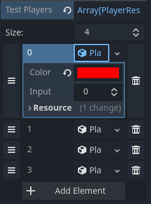

# Chimera Party Lab

Laboratorio (plantilla) de minijuegos para [*Chimera Party*](https://github.com/elixs/chimera-party), un Party Game colaborativo de la comunidad de desarrollo de videojuegos de la Universidad de Chile.

<p align="center">
  <a href="#instalación">Instalación</a> •
  <a href="#diseño">Diseño</a> •
  <a href="#setup">Setup</a> •
  <a href="#desarrollo">Desarrollo</a> •
  <a href="#importación">Exportación</a> •
  <a href="#importación">Importación</a> •
  <a href="#creditos">Créditos</a>
</p>

---

## Instalación

0. Instala [Godot 4.2.x](https://godotengine.org/download).
1. Clona este repositorio.
2. Abre godot e importa el proyecto.

## Diseño

Al desarrollar tu minijuego, tienes libertad total en cuanto a la temática y las mecánicas de juego, la creatividad se valora mucho aquí! Sin embargo, debes adherirte a las siguientes restricciones para asegurar la jugabilidad y el equilibrio:

- 🔢 **Número de jugadores:** El juego debe estar diseñado para ser jugado por entre 2 y 8 participantes. Puedes enfocarte en un número (o rango) específico de jugadores, siempre y cuando se mantenga dentro de este límite.
- 🎨 **Representación de jugadores:** Es crucial que las representaciones en el juego de los jugadores sean claras y correspondan fielmente al color que cada uno elija al inicio del juego.
- 💯 **Puntaje:** Tu minijuego debe incluir un elemento competitivo, asignando puntajes a los jugadores por su desempeño. Importante: el puntaje máximo que un jugador puede obtener **no debe exceder los 100 puntos**, ni ser menor a los -100 puntos.
- ⌚ **Tiempo:** Se sugiere no superar un tiempo de ronda de 1 minuto. La idea es que el juego progrese rápido para alcanzar a jugar una gran variedad de minijuegos.

## Setup

Una vez [instalado](#instalación), cambia el nombre de la carpeta `res://games/my_game` al nombre de tu juego. La carpeta `my_game` ya viene con un boilerplate de juego que puedes usar de referencia.

> [!WARNING] Todo el contenido de tu juego debe estar dentro de la carpeta creada a base de "my_game". Esto incluye código, escenas, sprites, etc.

### Datos del minijuego

En el recurso `info.tres` se define el nombre, la descripción y la portada de tu juego:



También se definen los inputs que usa tu juego. Estos se muestran como iconos al partir la ronda. Estos consisten en un arreglo de grupos de botones con una descripción. Por ejemplo, Left, Right, Up y Down descritos como Walk.



> [!TIP] Puedes ver un preview de tu pantalla de información corriendo la escena game_info.tscn en la carpeta ui_lab.

### Configuración del ambiente de testing

En el nodo `Game` de `game.tscn` en `autoload_lab` se definen parametros de testeo, que no seran aplicados en la versión exportada del minijuego.

#### Test Players

El numero de jugadores que deseas tener al **testear** tu juego, con sus colores correspondientes.



#### Test Game Path

La ruta del `main.tscn` de tu minijeugo, luego de que le hayas cambiado el nombre a la carpeta.

#### Test Game Info

El recurso `info.tres` mencionado en [Datos del minijuego](#datos-del-minijuego).

## Desarrollo

A continuación, se explica como usar las interfaces y carácteristicas de *Chimera Party* para crear tu minijuego.

### Jugadores

Se puede conseguir la lista de jugadores con:

```gdscript
Game.players: List[PlayerData]
```

Un objeto `PlayerData` consiste en:

| Nombre            | Tipo    | Descripción                                                        |
| ----------------- | ------- | ------------------------------------------------------------------ |
| `input`           | `int`   | ID del layout y dispositivo de este jugador. Ver [input](#input)   |
| `primary_color`   | `Color` | Color principal del jugador. Ver [colores](#colores)               |
| `secondary_color` | `Color` | Color secundario del jugador. *Experimental*                       |
| `score`           | `int`   | Puntaje total del jugador en la partida. Ver [puntaje](#puntaje)   |
| `local_score`     | `int`   | Puntaje del jugador en **este** minijuego. Ver [puntaje](#puntaje) |

### Input

#### Dispositivos/layouts

| ID  | Dispositio | Direccional | Acción        |
| --- | ---------- | ----------- | ------------- |
| 0   | Teclado    | W, A, S, D  | Z, X          |
| 1   | Teclado    | T, F, G, H  | V, B          |
| 2   | Teclado    | I, J, K, L  | N, M          |
| 3   | Teclado    | ↑, ←, ↓, →  | RShift, RCtrl |
| 4   | Gamepad 0  | ↑, ←, ↓, →  | A, B          |
| 5   | Gamepad 1  | ↑, ←, ↓, →  | A, B          |
| 6   | Gamepad 2  | ↑, ←, ↓, →  | A, B          |
| 7   | Gamepad 3  | ↑, ←, ↓, →  | A, B          |

#### Usando input

Donde `x` es el ID del input del jugador, las acciones de input en el proyecto tienen los siguientes nombres `move_up_x`, `move_left_x`, `move_down_x`, `move_right_x`, `action_a_x`, `action_b_x`.

Estas se pueden llamar como cualquier input de godot ya sea con eventos:

```gdscript
func _input(event):
    if event.is_action_pressed("move_up_" % player_data.input):
        jump()
```

O con polling:

```gdscript
func _physics_process(delta):
    if Input.is_action_pressed("move_right_" % player_data.input):
        position.x += speed * delta
```

Si usas de base la clase [CharacterPlayer](https://github.com/vgdev-uchile/chimera-party-lab/blob/master/scripts/character_player.gd), esto se simplifica. Se puede llamar directamente a `move_up`, `move_left`, `move_down`, `move_right`, `action_a` y `action_b`. Por ejemplo:

```gdscript
func _physics_process(delta: float) -> void:
    var move_input = Input.get_vector(
        move_left,
        move_right,
        move_up,
        move_down
    )
```

### Colores

El color del jugador se puede conseguir con

```gdscript
player_data.color
```

Si usas de base la clase [CharacterPlayer](https://github.com/vgdev-uchile/chimera-party-lab/blob/master/scripts/character_player.gd), puedes hacerle override a la función `update_color` para definir que hacer con el color del jugador. Por ejemplo:

```gdscript
func update_color() -> void:
    body_sprite.self_modulate = data.primary_color
```

> [!IMPORTANT] Pendiente: incluir explicación de los shaders

### Puntaje

### Game Over

Cuando se haya concluido la ronda de tu minijuego, debes llamar:

```gdscript
Game.end_game()
```

### Utilidades

Se puede mostrar un mensaje en pantalla con:

```python
Debug.log("message")
```

## Exportación

Una vez tengas listo tu juego, debes exportarlo para que se pueda instalar en el *Chimera Party*.

1. Ir al menu `Project` > `Export` del proyecto en Godot.
2. Elegir la plataforma. Por defecto *Chimera Party* está pensado para Windows.
3. Seleccionar la opción `PCK/Zip`.
4. Nombrar el archivo resultante con el **mismo nombre que la carpeta de tu juego**.
5. Guardar como `Godot Project Pack .PCK`.

> todo: gif

## Importación

Para agregar un minijuego a la rotación del Chimera Party:

1. Descargar el último [ejecutable de *Chimera Party*](https://github.com/vgdev-uchile/chimera-party/releases).
2. Crear una carpeta `games` como hermano del ejecutable.
3. Dejar el `.pck` del minijuego en la carpeta `games`.

### Ejemplo

```bash
.
├── games/
│   ├── chimerin_quest.pck
│   └── beyond_them.pck
└── Chimera_Party.exe
```

> [!NOTE] En una partida normal cuando sale un minijuego una vez, su probabilidad de salir nuevamente en la misma partida se reduce a un 10%.

## Creditos

- Proyecto de la Comunidad VGDEV UCHILE.
- Creado por: [Elías Zelada](https://github.com/elixs)
- Contribuciones:
  - [Eric K](https://github.com/Nyveon)
